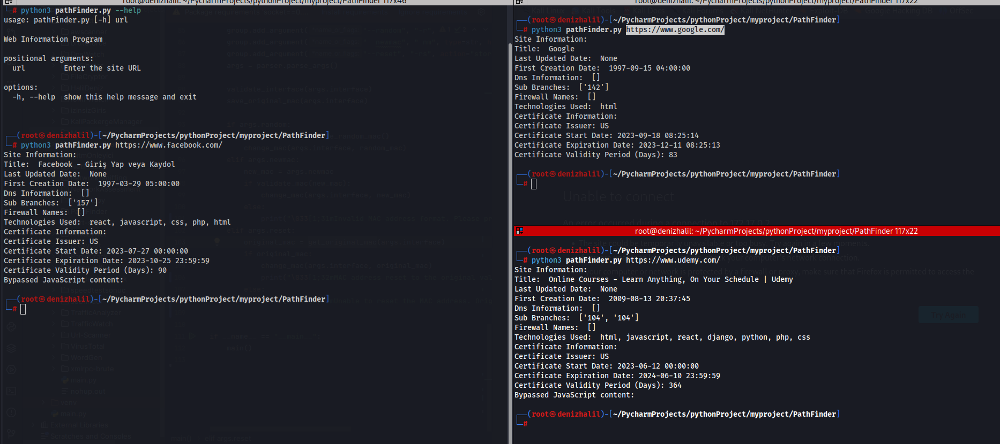

# Web Path Finder

Web Path Finder is a Python program that provides information about a website. It retrieves various details such as page title, last updated date, DNS information, subdomains, firewall names, technologies used, certificate information, and more.


## Features and Benefits
- Retrieve important information about a website
- Gain insights into the technologies used by a website
- Identify subdomains and DNS information
- Check firewall names and certificate details
- Perform bypass operations for captcha and JavaScript content

## Getting Started

1. Clone the repository:
    ```shell
    git clone https://github.com/HalilDeniz/PathFinder.git
    ```
   
2. Install the required packages:
    ```shell
    pip install -r requirements.txt
    ```

This will install all the required modules and their respective versions.

### Usage

Run the program using the following command:

```shell
┌──(root💀denizhalil)-[~/MyProjects/]
└─# python3 web-info-explorer.py --help                                             
usage: wpathFinder.py [-h] url

Web Information Program

positional arguments:
  url         Enter the site URL

options:
  -h, --help  show this help message and exit
```

Replace `<url>` with the URL of the website you want to explore.

### Example Output

Here is an example output of running the program:

```shell
┌──(root💀denizhalil)-[~/MyProjects/]
└─# python3 pathFinder.py https://www.facebook.com/
    Site Information:
    Title:  Facebook - Login or Register
    Last Updated Date:  None
    First Creation Date:  1997-03-29 05:00:00
    Dns Information:  []
    Sub Branches:  ['157']
    Firewall Names:  []
    Technologies Used:  javascript, php, css, html, react
    Certificate Information:
    Certificate Issuer: US
    Certificate Start Date: 2023-02-07 00:00:00
    Certificate Expiration Date: 2023-05-08 23:59:59
    Certificate Validity Period (Days): 90
    Bypassed JavaScript content:  
```

## Contributing
Contributions are welcome! To contribute to PathFinder, follow these steps:

1. Fork the repository.
2. Create a new branch for your feature or bug fix.
3. Make your changes and commit them.
4. Push your changes to your forked repository.
5. Open a pull request in the main repository.


## Thanks
- Thank you my friend Varol

## License
This project is licensed under the MIT License - see the [LICENSE](LICENSE) file for details.

## Contact
For any inquiries or further information, you can reach me through the following channels:

- LinkedIn: [Halil Ibrahim Deniz](https://www.linkedin.com/in/halil-ibrahim-deniz/)
- TryHackMe: [Halilovic](https://tryhackme.com/p/halilovic)
- Instagram: [deniz.halil333](https://www.instagram.com/deniz.halil333/)
- YouTube: [Halil Deniz](https://www.youtube.com/c/HalilDeniz)
- Email: halildeniz313@gmail.com

